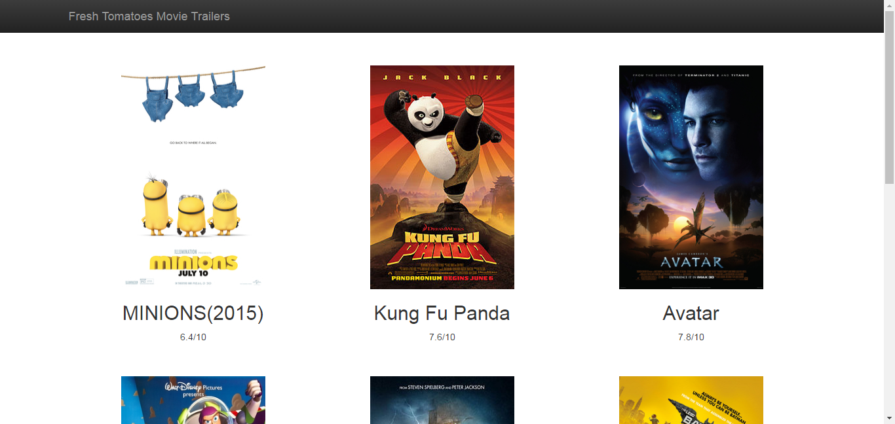
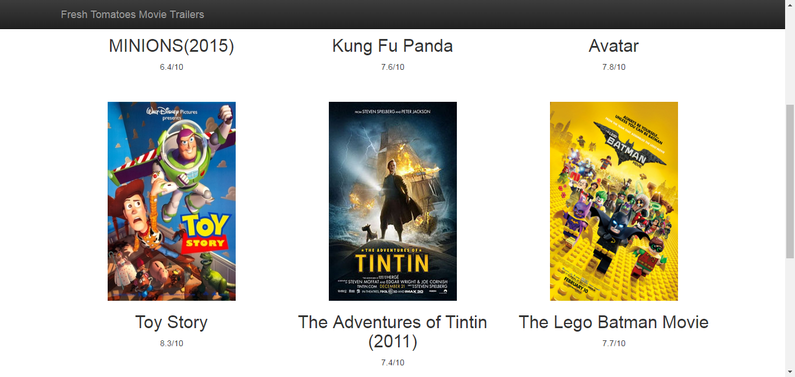

# Project: Udacity:Programming Foundations with Python:MovieTrailer
Movie Trailer Website Project is a part of Udacity "Full Stack Web Developer Nanodegree"

#Environment
You'll need the following for your development environment:
Python

#Screenshots form the site

 
 

#Instruction to run this program

1. Install python 2.7
2. Go to cmd and write this command  python entertainment.py 
NOTE:
you must add python to environment variable to run the pervious command from cmd
